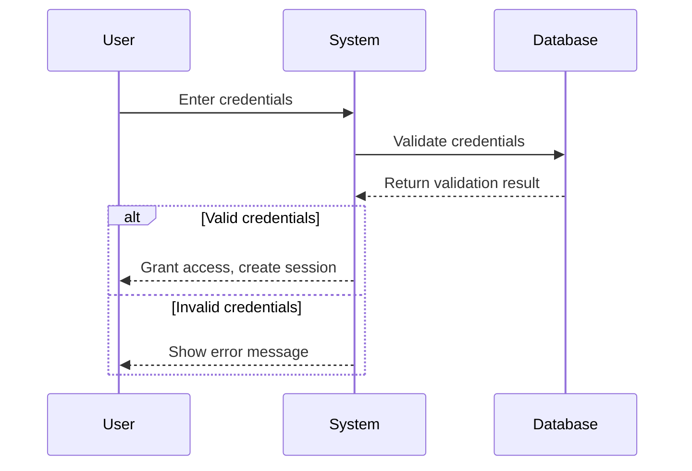

# Software Requirements Specification (SRS) 📄

> Interactive template for documenting software requirements

<!--
HOW TO USE THIS TEMPLATE:
1. Copy this file to your project
2. Fill in each section with project-specific details
3. Check off items as they are completed
4. Use the interactive checklists to track progress
5. Update version number with each major revision
-->

## Document Information

| Field | Value |
|-------|-------|
| **Project Name** | [Enter Project Name] |
| **Version** | 1.0.0 |
| **Status** | [ ] Draft [ ] Under Review [ ] Approved |
| **Author** | [Your Name] |
| **Last Updated** | [YYYY-MM-DD] |
| **Approved By** | [Approver Name] |
| **Approval Date** | [YYYY-MM-DD] |

---

## Table of Contents

1. [Introduction](#1-introduction)
2. [Overall Description](#2-overall-description)
3. [Specific Requirements](#3-specific-requirements)
4. [System Features](#4-system-features)
5. [External Interface Requirements](#5-external-interface-requirements)
6. [Non-Functional Requirements](#6-non-functional-requirements)
7. [Other Requirements](#7-other-requirements)
8. [Appendices](#8-appendices)

---

## 1. Introduction

### 1.1 Purpose

<!--
Describe the purpose of this SRS document and the software being specified.
-->

- [ ] Purpose statement completed

**Purpose:**
> [Describe the purpose of this document and what software it specifies]

### 1.2 Scope

<!--
Identify the software product(s) to be produced by name.
Explain what the software will do and what it won't do.
Describe the application of the software being specified.
-->

- [ ] Software product identified
- [ ] Scope boundaries defined

**Product Name:** [Name]

**What It Will Do:**
- [ ] [Core functionality 1]
- [ ] [Core functionality 2]
- [ ] [Core functionality 3]

**What It Won't Do:**
- [Exclusion 1]
- [Exclusion 2]

### 1.3 Definitions, Acronyms, and Abbreviations

<!--
Define all terms, acronyms, and abbreviations used in this document.
-->

| Term | Definition |
|------|------------|
| API | Application Programming Interface |
| SRS | Software Requirements Specification |
| UI | User Interface |
| [Add more] | [Definition] |

### 1.4 References

<!--
List all documents referenced in this SRS.
-->

| Document | Version | Link/Location |
|----------|---------|---------------|
| [Document Name] | [Version] | [URL/Path] |

### 1.5 Overview

<!--
Describe what the rest of this SRS contains and how it is organized.
-->

> [Describe the structure of this document]

---

## 2. Overall Description

### 2.1 Product Perspective

<!--
Describe the context and origin of the product.
Is it a new product? A replacement? Part of a larger system?
-->

- [ ] Product context defined
- [ ] System interfaces identified

**System Context Diagram:**

```
┌─────────────────────────────────────────────────────┐
│                   [System Name]                      │
├─────────────────────────────────────────────────────┤
│                                                      │
│    ┌──────────┐    ┌──────────┐    ┌──────────┐    │
│    │  User    │    │  Admin   │    │ External │    │
│    │Interface │    │Interface │    │  System  │    │
│    └────┬─────┘    └────┬─────┘    └────┬─────┘    │
│         │               │               │           │
│    ┌────▼───────────────▼───────────────▼────┐     │
│    │           Core Application               │     │
│    └────────────────────┬────────────────────┘     │
│                         │                           │
│    ┌────────────────────▼────────────────────┐     │
│    │              Database                    │     │
│    └─────────────────────────────────────────┘     │
│                                                      │
└─────────────────────────────────────────────────────┘
```

### 2.2 Product Functions

<!--
Provide a summary of the major functions the software will perform.
-->

- [ ] All major functions identified

| Function ID | Function Name | Description | Priority |
|-------------|---------------|-------------|----------|
| F-001 | [Function] | [Description] | High/Medium/Low |
| F-002 | [Function] | [Description] | High/Medium/Low |
| F-003 | [Function] | [Description] | High/Medium/Low |

### 2.3 User Classes and Characteristics

<!--
Identify the various user classes that will use this product.
-->

- [ ] All user classes identified
- [ ] User characteristics documented

| User Class | Description | Access Level | Technical Proficiency |
|------------|-------------|--------------|----------------------|
| Admin | System administrator | Full | High |
| User | Standard user | Limited | Medium |
| Guest | Unauthenticated visitor | Read-only | Low |
| [Add more] | [Description] | [Level] | [Proficiency] |

### 2.4 Operating Environment

<!--
Describe the environment in which the software will operate.
-->

- [ ] Operating environment specified

**Hardware Requirements:**

| Component | Minimum | Recommended |
|-----------|---------|-------------|
| CPU | [Min] | [Rec] |
| Memory | [Min] | [Rec] |
| Storage | [Min] | [Rec] |

**Software Requirements:**

| Software | Version | Required/Optional |
|----------|---------|-------------------|
| OS | [Version] | Required |
| Browser | [Version] | Required |
| [Add more] | [Version] | [Required/Optional] |

### 2.5 Design and Implementation Constraints

<!--
List any constraints that limit design or implementation choices.
-->

- [ ] Constraints identified

**Constraints:**

- [ ] [Constraint 1: e.g., Must use existing database]
- [ ] [Constraint 2: e.g., Must comply with GDPR]
- [ ] [Constraint 3: e.g., Must integrate with legacy system]

### 2.6 Assumptions and Dependencies

<!--
List factors that affect requirements but are outside scope of this SRS.
-->

- [ ] Assumptions documented
- [ ] Dependencies identified

**Assumptions:**

1. [Assumption 1]
2. [Assumption 2]
3. [Assumption 3]

**Dependencies:**

| Dependency | Type | Impact if Unavailable |
|------------|------|----------------------|
| [Dependency] | External Service | [Impact] |
| [Dependency] | Library | [Impact] |

---

## 3. Specific Requirements

### 3.1 Functional Requirements

<!--
Detail the specific functionality the system must provide.
Use the template below for each requirement.
-->

#### Template for Functional Requirements

```markdown
#### FR-XXX: [Requirement Name]

**Description:** [What the system shall do]
**Priority:** High | Medium | Low
**Source:** [Stakeholder/Document]
**Rationale:** [Why this is needed]

**Inputs:**
- [Input 1]
- [Input 2]

**Processing:**
1. [Step 1]
2. [Step 2]
3. [Step 3]

**Outputs:**
- [Output 1]
- [Output 2]

**Acceptance Criteria:**
- [ ] [Criterion 1]
- [ ] [Criterion 2]
- [ ] [Criterion 3]
```

---

#### FR-001: [User Registration]

**Description:** The system shall allow new users to register with email and password
**Priority:** High
**Source:** [Stakeholder]
**Rationale:** Users must be able to create accounts to access the system

**Inputs:**

- Email address
- Password
- Name (optional)

**Processing:**

1. Validate email format
2. Check email is not already registered
3. Validate password meets requirements
4. Create user account
5. Send verification email

**Outputs:**

- Success message with verification instructions
- Error message if validation fails

**Acceptance Criteria:**

- [ ] Email must be valid format
- [ ] Password must be at least 8 characters
- [ ] Duplicate emails are rejected
- [ ] Verification email is sent within 1 minute

---

#### FR-002: [Add Your Requirement]

**Description:** [Description]
**Priority:** [Priority]
**Source:** [Source]
**Rationale:** [Rationale]

**Inputs:**

- [Input]

**Processing:**

1. [Step]

**Outputs:**

- [Output]

**Acceptance Criteria:**

- [ ] [Criterion]

---

### 3.2 Business Rules

<!--
List any business rules that affect the requirements.
-->

| Rule ID | Rule Description | Affected Requirements |
|---------|------------------|----------------------|
| BR-001 | [Rule] | FR-XXX |
| BR-002 | [Rule] | FR-XXX |

---

## 4. System Features

<!--
Organize requirements into logical system features/modules.
-->

### 4.1 Feature: [Authentication Module]

**Description:** Handles user authentication and session management

**Priority:** High

**Stimulus/Response Sequences:**



**Functional Requirements:**

- [ ] FR-001: User Registration
- [ ] FR-002: User Login
- [ ] FR-003: Password Reset
- [ ] FR-004: Session Management

### 4.2 Feature: [Add Your Feature]

**Description:** [Description]

**Priority:** [Priority]

**Functional Requirements:**

- [ ] FR-XXX: [Requirement]

---

## 5. External Interface Requirements

### 5.1 User Interfaces

<!--
Describe the user interface characteristics.
-->

- [ ] UI requirements documented

**General UI Requirements:**

- [ ] Responsive design (mobile, tablet, desktop)
- [ ] Accessibility compliance (WCAG 2.1 AA)
- [ ] Support for [languages]
- [ ] Dark/light mode support

**Screen Mockups:**

> [Include links to mockups/wireframes]

### 5.2 Hardware Interfaces

<!--
Describe any hardware interfaces.
-->

- [ ] Hardware interfaces specified (if applicable)

| Interface | Description | Protocol |
|-----------|-------------|----------|
| [Interface] | [Description] | [Protocol] |

### 5.3 Software Interfaces

<!--
Describe connections with other software systems.
-->

- [ ] Software interfaces documented

| System | Purpose | Protocol | Data Format |
|--------|---------|----------|-------------|
| [System Name] | [Purpose] | REST/gRPC/etc. | JSON/XML/etc. |

### 5.4 Communications Interfaces

<!--
Describe any communications functions.
-->

- [ ] Communication requirements specified

| Interface | Description | Protocol | Port |
|-----------|-------------|----------|------|
| HTTP/HTTPS | Web traffic | TLS 1.3 | 443 |
| WebSocket | Real-time updates | WSS | 443 |

---

## 6. Non-Functional Requirements

### 6.1 Performance Requirements

- [ ] Performance requirements defined

| Metric | Requirement | Measurement Method |
|--------|-------------|-------------------|
| Response Time | < 200ms for 95th percentile | APM monitoring |
| Throughput | 1000 requests/second | Load testing |
| Concurrent Users | 10,000 simultaneous | Stress testing |

### 6.2 Safety Requirements

- [ ] Safety requirements identified

| Requirement | Description | Priority |
|-------------|-------------|----------|
| [Requirement] | [Description] | [Priority] |

### 6.3 Security Requirements

- [ ] Security requirements documented

| Requirement ID | Description | Standard/Compliance |
|---------------|-------------|---------------------|
| SEC-001 | All data in transit must be encrypted | TLS 1.3 |
| SEC-002 | Passwords must be hashed | bcrypt/Argon2 |
| SEC-003 | Session tokens must expire | OWASP Guidelines |
| SEC-004 | [Add more] | [Standard] |

### 6.4 Software Quality Attributes

#### 6.4.1 Reliability

- [ ] System uptime: 99.9% availability
- [ ] Mean Time Between Failures (MTBF): [Target]
- [ ] Mean Time To Recovery (MTTR): < 1 hour

#### 6.4.2 Scalability

- [ ] Horizontal scaling capability
- [ ] Database read replicas supported
- [ ] Caching layer implemented

#### 6.4.3 Maintainability

- [ ] Code coverage: > 80%
- [ ] Documentation updated with each release
- [ ] Modular architecture

#### 6.4.4 Portability

- [ ] Container-based deployment
- [ ] Cloud-agnostic design
- [ ] Environment configuration via variables

---

## 7. Other Requirements

### 7.1 Database Requirements

- [ ] Database requirements specified

| Requirement | Description |
|-------------|-------------|
| Type | [PostgreSQL/MySQL/MongoDB/etc.] |
| Backup | Daily automated backups |
| Retention | [X days/months] |
| Encryption | At-rest encryption required |

### 7.2 Legal Requirements

- [ ] Legal requirements identified

| Requirement | Description | Compliance |
|-------------|-------------|------------|
| Data Privacy | User data handling | GDPR/CCPA |
| Accessibility | UI accessibility | WCAG 2.1 |
| [Add more] | [Description] | [Compliance] |

### 7.3 Internationalization

- [ ] i18n requirements specified

| Requirement | Description |
|-------------|-------------|
| Languages | [List supported languages] |
| Date/Time | Localized formatting |
| Currency | Multi-currency support |

---

## 8. Appendices

### Appendix A: Glossary

| Term | Definition |
|------|------------|
| [Term] | [Definition] |

### Appendix B: Analysis Models

> [Include data flow diagrams, entity-relationship diagrams, etc.]

### Appendix C: To Be Determined List

<!--
Track items that need further clarification or decisions.
-->

| ID | Item | Status | Assigned To | Due Date |
|----|------|--------|-------------|----------|
| TBD-001 | [Item] | Open | [Person] | [Date] |
| TBD-002 | [Item] | In Progress | [Person] | [Date] |

---

## Revision History

| Version | Date | Author | Description |
|---------|------|--------|-------------|
| 1.0.0 | [Date] | [Author] | Initial draft |
| [Next] | [Date] | [Author] | [Changes] |

---

## Sign-Off

### Technical Approval

| Role | Name | Signature | Date |
|------|------|-----------|------|
| Tech Lead | | | |
| Architect | | | |

### Business Approval

| Role | Name | Signature | Date |
|------|------|-----------|------|
| Product Owner | | | |
| Stakeholder | | | |

---

**Document Status Checklist:**

- [ ] All sections completed
- [ ] All TBD items resolved
- [ ] Technical review complete
- [ ] Business review complete
- [ ] Stakeholder sign-off obtained
- [ ] Document approved and baselined
